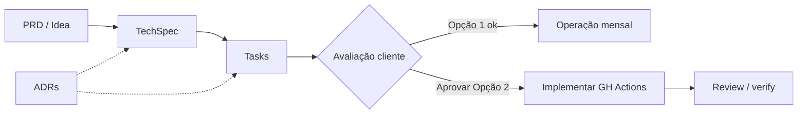
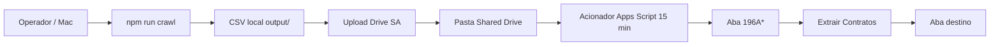
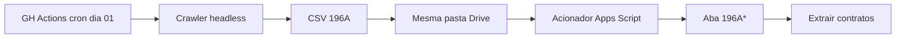
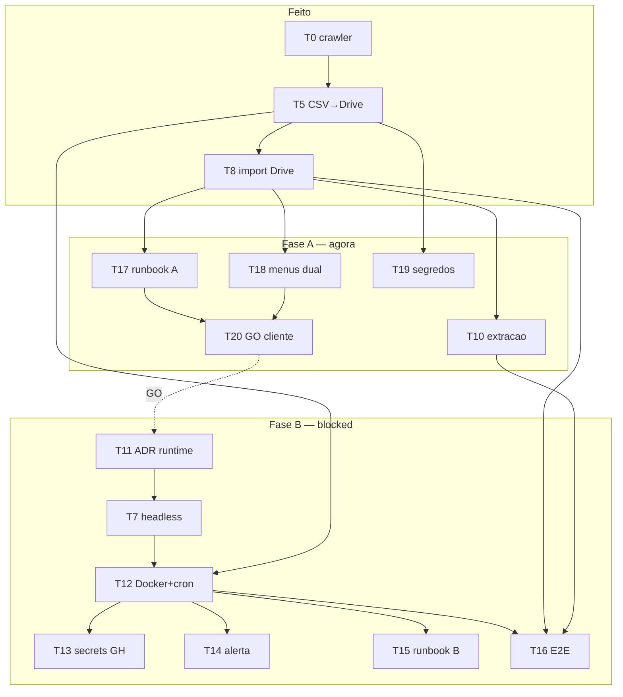

# Integração 196A — Documentação consolidada

*Status:* **Opção 1 em operação** · Opção 2 (GitHub Actions) **aguardando avaliação do cliente**  
*Atualizado:* 12 ago 2026  
*Método:* pipeline Idea → TechSpec → Tasks → ADRs (referência Pedro Nauck / CompozyOS)  
*Ref:* [`docs/referencia-pedro-nauk.md`](../referencia-pedro-nauk.md)

---

## Sumário

0. [Metodologia aplicada](#0-metodologia-aplicada)
1. [PRD / Idea](#1-prd--idea)
2. [TechSpec + grafos](#2-techspec--grafos)
3. [Tasks](#3-tasks)
4. [Decisões (ADRs)](#4-decisões-adrs)

---

## 0. Metodologia aplicada

Artefato único do pipeline Nauck para a integração 196A: **PRD → TechSpec → Tasks → ADRs**.

**Estratégia:** não implementar em prompt único. Markdown versionável, grafos Mermaid, tasks com dependências e status, memória em ADRs.



### Papéis (estilo CompozyOS)

| Papel | Neste projeto |
|-------|----------------|
| Memória | Este MD + ADRs + READMEs |
| Spec | Seção TechSpec abaixo |
| Tasks | Seção 3 (status explícito) |
| Execução | Task a task — não “implementa tudo” |
| Review | Critérios de aceite + checklist |

---

## 1. PRD / Idea

### 1.1 Problema

A CEMA precisa, todo mês, do relatório **196A — Movimentações por categoria** (conta **1.1.1 Taxa de administração**) na planilha Google Sheets, para extrair contratos.

O caminho antigo (cookie manual / colar CSV) é frágil. A API `app_token`/`access_token` **não** substitui o 196A (isso é outro fluxo: Recebimentos / Taxa Adm Realizada).

### 1.2 Objetivo (Outcome)

1. **Agora (Opção 1):** CSV chega na pasta Drive → Acionador Sheets preenche `196A*` → extração de contratos.
2. **Depois (Opção 2 — pós avaliação do cliente):** no **dia 01**, GitHub Actions roda o crawler sem Mac e publica o CSV na **mesma** pasta Drive.

### 1.3 Escopo

#### In scope
- Crawler Playwright (`integrations/superlogica-crawler`)
- Relatório 196A (filtros: **mês anterior**, categoria 1.1.1, Detalhado)
- Export CSV + upload Drive (Unidade compartilhada + service account)
- Apps Script: import Drive → `196A*` + extrair contratos
- Agendamento nuvem (Opção 2) — **planejado, não implementar até GO do cliente**
- Documentação versionável (`docs/`)

#### Out of scope
- Substituir a API oficial de cobranças/repasses
- Kubernetes
- CompozyOS em produção (só metodologia)
- Reescrita do `superlogica-cobrancas-analitico.gs`

### 1.4 Fases de produto

| Fase | Nome | Status |
|------|------|--------|
| **A** | Opção 1 — CSV → Drive → Acionador Sheets | **Em operação** |
| **B** | Opção 2 — GitHub Actions dia 01 | **Bloqueada** — aguarda avaliação do cliente |
| **C** | Cookie na planilha / UrlFetch (caminho B) | Opcional / baixa prioridade |

### 1.5 Critérios de sucesso

#### Fase A (atuais)
- [x] Crawler gera CSV 196A (mês anterior)
- [x] Upload para pasta Drive `196a-automacao-superlogica-controller` (Shared Drive)
- [x] Acionador / menu importa CSV → aba `196A*`
- [x] Sucesso → lixeira; falha → `execucoes-com-erro`
- [ ] Runbook operacional documentado e validado com o cliente
- [ ] Extração de contratos encadeada ou checklist claro pós-import

#### Fase B (após GO do cliente)
- [ ] Dia 01: job roda sem Mac ligado
- [ ] Secrets no GitHub (não no notebook)
- [ ] Alerta se login/OTP/CSV falhar
- [ ] E2E em planilha cópia / staging

---

## 2. TechSpec + grafos

### 2.1 Arquitetura — Fase A (em operação)



**Contrato da pasta**

```
196a-automacao-superlogica-controller/   ← Unidade compartilhada
  ├── CSV novo
  └── execucoes-com-erro/
```

### 2.2 Arquitetura-alvo — Fase B (pós avaliação)



A Fase B **reutiliza** a pasta e o Apps Script da Fase A — não troca o contrato.

### 2.3 Separação de mundos (não misturar)

| Mundo | Credencial | Abas / artefato |
|-------|------------|-----------------|
| API Superlógica | `app_token` + `access_token` | Recebimentos, Composição, Contratos, Taxa Adm Realizada, Resumo |
| Web 196A | Sessão browser / CSV | Aba `196A*` + destino da extração |

No Apps Script da planilha: **dois arquivos**, **um** `onOpen` (no analítico).

### 2.4 Runtime (ranking — fácil + barato)

| # | Opção | Status neste projeto |
|---|--------|----------------------|
| 1 | CSV → Drive → Acionador Sheets | **Fase A — em operação** |
| 2 | GitHub Actions dia 01 | **Fase B — após GO cliente** |
| 3 | Renovar cookie 2d + Acionador | Não priorizado |
| 4 | Render/Railway cron | Alternativa se GH Actions falhar |
| 5 | Oracle/GCP free VM | Alternativa |
| 6 | E-mail Superlógica → Apps Script | Só se produto for confiável |

### 2.5 Pipeline de desenvolvimento (Nauck)

1. Atualizar PRD/ADR se a decisão mudar  
2. Abrir/mover tasks (status)  
3. Implementar **só** tasks `todo` liberadas (não as `blocked`)  
4. Verify / review  
5. Registrar aprendizado no ADR  

**Anti-padrões:** prompt gigante; misturar API + 196A; implementar GH Actions antes do GO do cliente.

---

## 3. Tasks

### Legenda

- `status`: `todo` | `doing` | `done` | `blocked`
- `type`: `docs` | `crawler` | `sheets` | `infra` | `verify` | `ops`
- `complexity`: `S` | `M` | `L`

### Mapa rápido

| Bloco | IDs | Situação |
|-------|-----|----------|
| Baseline | T0–T2, T5, T8 | done |
| Operação Fase A | T10, T17–T20 | **fazer agora** |
| Cookie (opcional) | T3, T4, T9 | backlog baixo |
| Fase B GH Actions | T11–T16 | **blocked** até GO do cliente |

---

### Já feito (baseline + Fase A técnica)

```yaml
id: T0
title: Crawler login + MFA + 196A filtros + export CSV local
status: done
type: crawler
complexity: L
notes: >
  Período = Mês anterior. Download via histórico/impressões.
  Upload Drive com service account + Unidade compartilhada.
```

```yaml
id: T0b
title: Parser extracao-contratos-196a.gs (aba 196A* → destino)
status: done
type: sheets
complexity: M
```

```yaml
id: T1
title: PRD + TechSpec + grafos Mermaid + ADRs
status: done
type: docs
complexity: S
```

```yaml
id: T2
title: READMEs apontando para docs/196a-integracao
status: done
type: docs
complexity: S
notes: Reorganizado em 12/08/2026 (raiz, docs, crawler, sheets).
```

```yaml
id: T5
title: Publicar CSV 196A no Google Drive após export
status: done
type: crawler
complexity: M
acceptance: Arquivo do mês na pasta Shared Drive; encoding preservado.
```

```yaml
id: T6
title: Download por id_impressao / documentos/download
status: done
type: crawler
complexity: M
notes: Fluxo estável nas runs de ago/2026.
```

```yaml
id: T8
title: Apps Script — importar CSV da pasta Drive para aba 196A*
status: done
type: sheets
complexity: M
notes: >
  Sucesso → lixeira. Falha → execucoes-com-erro.
  Acionador a cada 15 min + menu manual.
```

---

### Fase A — operação e fechamento (fazer agora)

```yaml
id: T10
title: Encadear ou documentar Extrair Contratos após import Drive
status: todo
type: sheets
complexity: S
dependencies: [T8]
acceptance: >
  Após import ok, operador sabe (ou o script enfileira) rodar
  Extrair Contratos na aba destino sem dúvida.
```

```yaml
id: T17
title: Runbook operacional Fase A (mensal)
status: todo
type: ops
complexity: S
dependencies: [T5, T8]
acceptance: >
  Checklist: crawl → upload → acionador → conferir 196A* → extrair.
  Inclui o que fazer se CSV for para execucoes-com-erro.
owner: operação CEMA + docs
```

```yaml
id: T18
title: Garantir dois .gs no Apps Script (analítico + 196A) e menus
status: todo
type: sheets
complexity: S
dependencies: [T8]
acceptance: >
  Menus Superlógica Analítico e Automações Privadas presentes.
  Importar por período (access_token) e Importar CSV Drive funcionam.
```

```yaml
id: T19
title: Checklist de segredos locais (.env, google-sa.json, storage-state)
status: todo
type: ops
complexity: S
dependencies: [T5]
acceptance: >
  Nenhum segredo no git. .auth/ e .env no .gitignore.
  Rotação documentada se vazamento.
```

```yaml
id: T20
title: Validação com cliente — Fase A está ok para uso mensal?
status: todo
type: verify
complexity: S
dependencies: [T17, T18]
acceptance: >
  Cliente confirma operação da Opção 1.
  Decisão registrada: GO / NÃO-GO para Fase B (GitHub Actions).
```

---

### Cookie / caminho B (backlog — não bloqueia)

```yaml
id: T3
title: Extrair cookie CEMA (PHPSESSID, server-id, filename)
status: todo
type: crawler
complexity: S
dependencies: [T1]
notes: Só se Fase C for priorizada.
```

```yaml
id: T4
title: Gravar cookie na planilha / Script Property
status: todo
type: crawler
complexity: M
dependencies: [T3]
```

```yaml
id: T9
title: Apps Script UrlFetch com cookie injetado
status: todo
type: sheets
complexity: M
dependencies: [T4, T6]
notes: Preferir manter CSV→Drive; este caminho é opcional.
```

---

### Fase B — GitHub Actions dia 01 (**blocked** até GO do cliente)

```yaml
id: T11
title: ADR runtime — confirmar GitHub Actions (ou alternativa)
status: blocked
type: infra
complexity: S
dependencies: [T20]
blocker: Aguarda avaliação/GO do cliente após Fase A.
```

```yaml
id: T7
title: Headless confiável (CI) — screenshots só em falha
status: blocked
type: crawler
complexity: S
dependencies: [T11]
blocker: Só após GO Fase B.
```

```yaml
id: T12
title: Dockerfile Playwright + workflow cron dia 01
status: blocked
type: infra
complexity: M
dependencies: [T7, T11, T5]
acceptance: >
  Cron dia 01 gera CSV e envia à mesma pasta Drive.
  Sem intervenção no Mac.
blocker: Aguarda GO do cliente.
```

```yaml
id: T13
title: Secrets no GitHub (Superlogica, Gmail OTP, Google SA)
status: blocked
type: infra
complexity: S
dependencies: [T12]
```

```yaml
id: T14
title: Alerta de falha (e-mail/Telegram) se login/OTP/CSV falhar
status: blocked
type: infra
complexity: S
dependencies: [T12]
```

```yaml
id: T15
title: Runbook dia 01 (Fase B) + checklist de verificação
status: blocked
type: verify
complexity: S
dependencies: [T12, T8]
```

```yaml
id: T16
title: Teste ponta a ponta staging (GH Actions → Drive → Sheets)
status: blocked
type: verify
complexity: M
dependencies: [T12, T8, T10]
```

---

### Grafo de dependências (atual)



### Ordem sugerida

**Agora:** `T18 → T17 → T19 → T10 → T20`  

**Só após GO do cliente:** `T11 → T7 → T12 → T13 → T14 → T15 → T16`

---

## 4. Decisões (ADRs)

### ADR-001 — 196A usa sessão web, não app_token

**Decisão:** 196A via sessão browser / CSV; não via API de tokens.

### ADR-002 — PHPSESSID ~3 dias; server-id não autentica

**Decisão:** Cookie web é curto. Job mensal deve renovar sessão no dia do uso.

### ADR-003 — Preferir CSV → Drive → Sheets (fase 1)

**Decisão:** MVP = arquivo CSV na pasta Drive; Apps Script importa. Cookie na planilha é opcional.

**Contrato:** pasta Shared Drive + `execucoes-com-erro`.

### ADR-004 — Download via id de impressão

**Decisão:** Baixar o `id` da run atual (`baixar=1` / `documentos/download`).

### ADR-005 — Runtime fora do Mac; não K8s no MVP

**Decisão:** Default futuro = **GitHub Actions**. Só implementar após GO do cliente (ver ADR-008).

### ADR-006 — Pipeline de docs antes de código novo

**Decisão:** PRD → TechSpec → Tasks → implementação task a task.

### ADR-007 — Separar papéis crawler vs parser vs API

| Componente | Responsabilidade |
|------------|------------------|
| `superlogica-crawler` | Auth, UI 196A, CSV, upload Drive |
| `extracao-contratos-196a.gs` | Import Drive + parse `196A*` → destino |
| `superlogica-cobrancas-analitico.gs` | API tokens (Recebimentos, Taxa Adm, Resumo) |

### ADR-008 — Fase B (GH Actions) gated por avaliação do cliente

**Decisão:** Não implementar GitHub Actions / Docker cron enquanto o cliente não validar a Fase A e der GO explícito.

**Motivo:** Opção 1 já entrega valor; Opção 2 é custo/ops que depende de aceite.

**Consequência:** Tasks T7, T11–T16 ficam `blocked` até T20.

### ADR-009 — Upload Drive via Unidade compartilhada

**Decisão:** Pasta de entrada vive em **Shared Drive**; service account como Gerenciador de conteúdo.

**Motivo:** SA não tem cota no “Meu Drive” (`storageQuotaExceeded`).

### ADR-010 — Dois scripts Apps Script; um onOpen

**Decisão:** Planilha carrega analítico + 196A. `onOpen` só no analítico; chama `criarMenuAutomacoes196A_()`.

**Motivo:** Dois `onOpen` se sobrescrevem e “somem” o menu Importar por período.

### Pendências de decisão

- [x] Competência do relatório = **mês anterior** (crawler)
- [x] Pasta Drive = `196a-automacao-superlogica-controller` (Shared Drive)
- [ ] Canal de alerta Fase B (e-mail CEMA / Telegram) — decidir no GO
- [ ] Confirmar se Fase C (cookie) será feita algum dia
- [ ] T20 — GO / NÃO-GO do cliente para Fase B
